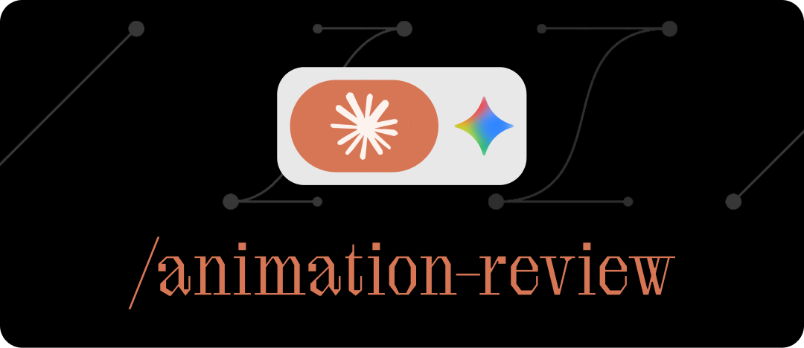

<p align="center">
  
</p>

# Animation Review

Get frame-level feedback on your web animations for hugely simplified tweaking and debugging. Automatically records the interaction in the browser with Playwright, sends the video to Gemini, and provides structured analysis — from a quick sanity check to frame-by-frame bug diagnosis.

The key workflow is **escalation**: start with a quick 5fps check, then target into a specific time ranges at 24fps when something needs closer inspection. Same video, no re-recording — Gemini clips server-side. 

Works as a [Claude Code](https://docs.anthropic.com/en/docs/claude-code) skill (Claude handles recording and analysis automatically) or standalone via CLI.

## Modes

The skill automatically handles selecting the right level of analysis, and adjusts the instructions and context it passes to Gemini accordingly. If you prefer, you can specify a mode explicitly.

| Mode | FPS | Model | |
|------|-----|-------|-|
| **check** | 5 | Flash | *"Does it work?"* — Quick pass/fail. Animations fire, complete, nothing visually breaks. |
| **review** | 12 | Flash | *"How does it feel?"* — Easing, timing, choreography, overall polish. Scored 1–10 against production standards. |
| **diagnose** | 24 | Pro | *"What's going wrong?"* — Frame-by-frame bug analysis with timestamps, pixel positions, and visual evidence for debugging. |
| **inspire** | 24 | Pro | *"How do I recreate this?"* — Decompose a reference video into a technology-agnostic animation spec. |

## Setup

### Prerequisites

- Python 3.8+
- [ffmpeg](https://ffmpeg.org/) (`brew install ffmpeg` on macOS)
- A [Gemini API key](https://aistudio.google.com/apikey)

### Quick install

```bash
npx skills add jaaaaaaaaaaack/custom-skills
pip install -r ~/.claude/skills/animation-review/requirements.txt
playwright install chromium
```

### API key

Set your Gemini API key as an environment variable. Add this to your shell profile (`~/.zshrc`, `~/.bashrc`, etc.):

```bash
export GEMINI_API_KEY=your-key-here
```

### Manual install

If you prefer not to use the skills CLI:

```bash
git clone https://github.com/jaaaaaaaaaaack/custom-skills.git
cd custom-skills/animation-review
pip install -r requirements.txt
playwright install chromium
mkdir -p ~/.claude/skills
ln -s "$(pwd)" ~/.claude/skills/animation-review
```

## Usage

### 1. Record

#### Automated (recommended)

Use `record_browser.py` to drive a headless browser. Playwright records internally — no screen recording permissions needed.

```bash
# Record a page load animation
python3 scripts/record_browser.py http://localhost:3000

# Click a button, wait for animation
python3 scripts/record_browser.py http://localhost:3000 \
  -a 'click:.play-btn' -a 'wait:2000'

# Custom viewport size
python3 scripts/record_browser.py http://localhost:3000 -W 375 -H 812
```

#### Manual (macOS only)

Use `record.sh` when you need to interact with the browser yourself:

```bash
bash scripts/record.sh -d 10
```

#### Existing video

Already have a recording? Skip straight to analysis — pass any `.mp4`, `.mov`, or `.webm` file to `analyze.py`.

### 2. Analyze

```bash
# Review design quality
python3 scripts/analyze.py -t review -p "Cards should stagger in with a spring ease"

# Diagnose a bug at full precision
python3 scripts/analyze.py -t diagnose \
  -p "The carousel jumps unexpectedly at the end of the rotation"

# Zoom into a specific time range (saves tokens, improves accuracy)
python3 scripts/analyze.py -t diagnose --start 2s --end 5s \
  -p "Card jumps position at ~3s during close animation"
```

Use `--json` or `--raw` to override the default output format (structured JSON for check/review, raw text for diagnose/inspire).

## Interpreting results

Gemini's visual observations (what changed between frames, timing, positions) are reliable. Its theories about *why* something happens are hypotheses — it can't see your code, DOM structure, or CSS. The `diagnose` output separates these into distinct **Observations** and **Hypotheses** sections for this reason.

Treat observations as evidence. Treat hypotheses as leads to investigate.

## Troubleshooting

- **`ffmpeg not found`**: Ensure ffmpeg is installed and in your PATH.
- **`playwright not found`**: Run `pip install playwright`.
- **Browser doesn't launch**: Run `playwright install chromium`.
- **Screen recording fails** (`record.sh`): Grant Screen Recording permission to your terminal app in macOS System Settings.

## License

MIT
